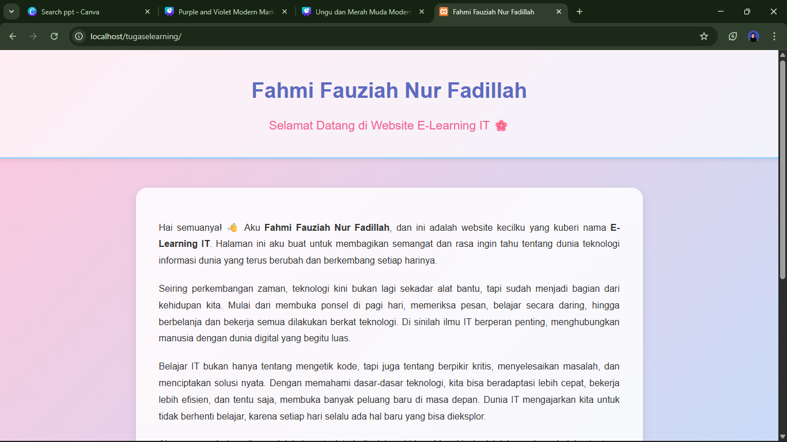
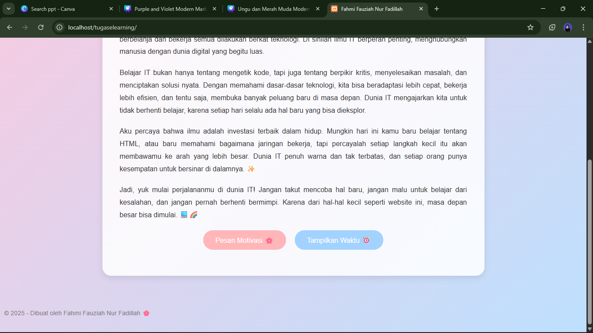
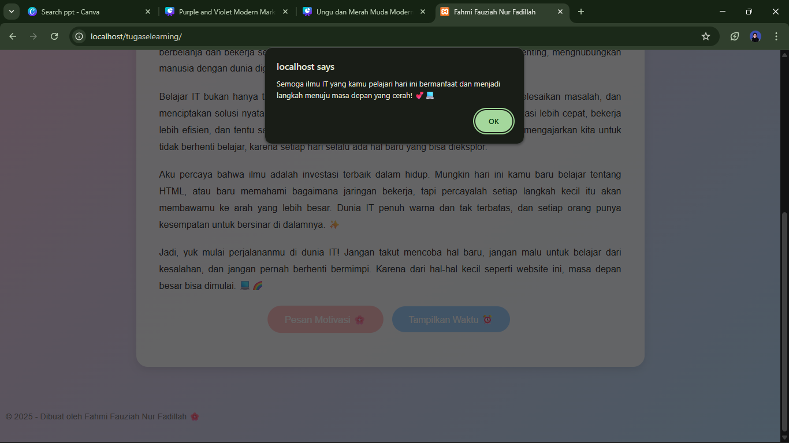
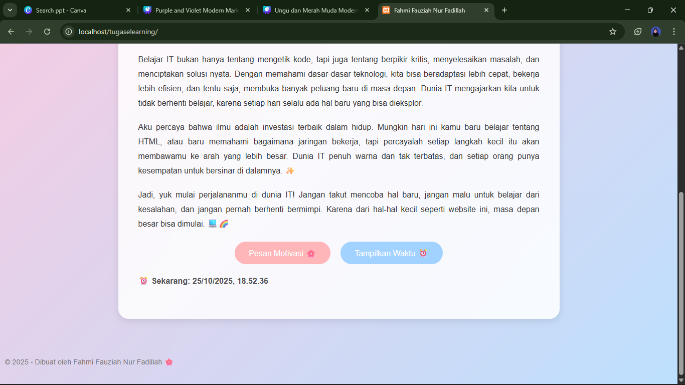

# Tugas E-Learning Pemrograman Web

Website sederhana yang dibuat untuk tugas mata kuliah **Pemrograman Web 1**

---

## 🌐 Deskripsi

Website ini bernama **E-Learning IT**, dibuat sebagai media pembelajaran dasar pemrograman web dengan tema biru pastel dan pink pastel.  
Halaman ini berisi perkenalan singkat, penjelasan mengenai dunia IT, dan motivasi belajar teknologi agar terus semangat menghadapi perkembangan zaman.  

Website ini menampilkan interaksi sederhana menggunakan **JavaScript**, dengan dua tombol yang memiliki fungsi:
- Menampilkan pesan motivasi.
- Menampilkan waktu saat ini secara real-time.

## 🖼️ Tampilan Website

Berikut hasil tampilan website setelah dijalankan di browser:
- Tampilan Pertama yang memperlihatkan nama

- Tampilan kedua yang memperlihatkan button
  

- Tampilan ketiga ketika di tekan button pesan motivasi
  

- Tampian keempat ketika di tekan button tampilan waktu
  

## 👩‍💻 Pembuat
**Fahmi Fauziah Nur Fadillah**  
📅 Tahun: 2025  
📘 Mata Kuliah: Pemrograman Web 1
🌸 Tema: E-Learning IT

---

© 2025 | Dibuat oleh Fahmi Fauziah Nur Fadillah
